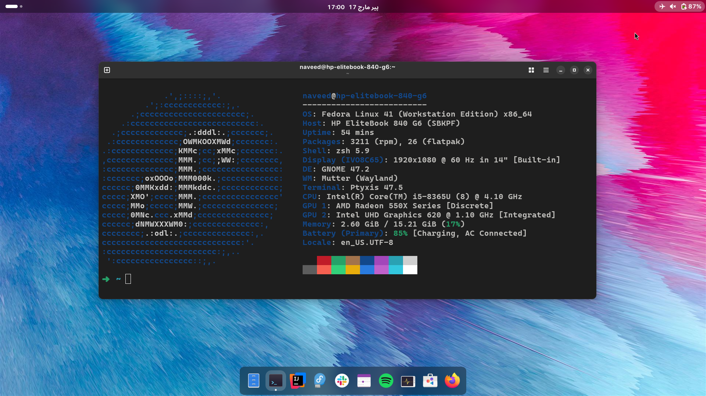

# Fedora Workstation Post Installation Configuration.

A set of productivity tools i usually install on my Fedora Workstation.



## DNF Configuration

```sh
sudo nano /etc/dnf/dnf.conf
```

Paste the following configurations.

```ini
[main]
gpgcheck=1
installonly_limit=3
clean_requirements_on_remove=True
best=True
skip_if_unavailable=False
max_parallel_downloads=5
fastestmirror=True
defaultyes=True
```

```sh
sudo dnf update
```

## Media Codecs

After installation enable 3rd party repositories. Then, update the system.

## Installing Java

```sh
sudo dnf install java-21-openjdk java-21-openjdk-devel
```

## Installing PHP

```sh
sudo dnf install php php-cli php-common
sudo dnf install php-mysqlnd
```

## Installing Apache Server

```sh
sudo dnf install httpd
```

## Configuring SELinux

```sh
sudo setsebool -P httpd_can_network_connect=1
sudo setsebool -P httpd_can_network_connect_db 1
```

## Installing MongoDB

```sh
sudo nano /etc/yum.repos.d/mongodb-org-7.0.repo
```

Paste the following configurations

```sh
[mongodb-org-7.0]
name=MongoDB Repository
baseurl=https://repo.mongodb.org/yum/redhat/9/mongodb-org/7.0/x86_64/
gpgcheck=1
enabled=1
gpgkey=https://pgp.mongodb.com/server-7.0.asc
```

Then

```sh
sudo yum install -y mongodb-org
sudo systemctl start mongod
```

## Installing MongoDB Compass

Download and install mongodb compass [here.](https://www.mongodb.com/try/download/compass)

## Installing Nodejs

As npm depends on nodejs so, i am installing npm, Node automatically installed.

```sh
sudo dnf install npm
```

## Installing MySql

Download the mysql repository [here.](https://dev.mysql.com/downloads/repo/yum/)

```sh
sudo dnf install mysql-community-server
```

```sh
sudo systemctl start mysqld
```

```sh
sudo mysql_secure_installation
```

```sh
sudo grep 'temporary password' /var/log/mysqld.log
```

## Git Config

```ini
git config --global user.email "you@example.com"
git config --global user.name "Your Name"
```

## Other Packages

### Inkscape

```sh
sudo dnf install inkscape
```

### ZSH Shell

```sh
sudo dnf install zsh
```

### RPM Build Tools

```sh
sudo dnf install rpm-build
```

### Neofetch

```sh
sudo dnf install neofetch
```

### Neofetch

```sh
sudo dnf install neovim
```

### Oh my zsh

```sh
wget https://github.com/robbyrussell/oh-my-zsh/raw/master/tools/install.sh -O - | zsh
```

### Radeontop

```sh
sudo dnf install radeontop
```

## Gnome Tweaks

```sh
sudo dnf install gnome-tweaks gnome-extensions-app
```

## Gnome Extensions

- [user themes.](https://extensions.gnome.org/extension/19/user-themes/)
- [Wiggle.](https://extensions.gnome.org/extension/6784/wiggle/)
- [Rounded Window Corners Reborn.](https://extensions.gnome.org/extension/7048/rounded-window-corners-reborn/)
- [Dash to Dock.](https://extensions.gnome.org/extension/307/dash-to-dock/)
- [Blur my Shell.](https://extensions.gnome.org/extension/3193/blur-my-shell/)

- [Desktop Icons NG (DING).](https://extensions.gnome.org/extension/2087/desktop-icons-ng-ding/)

## Optional IDE's And Tools

- [VSCode](https://code.visualstudio.com/download)
- [Android Studio](https://developer.android.com/studio)
- [Intellij Idea](https://www.jetbrains.com/idea/download)
- [Php Storm](https://www.jetbrains.com/phpstorm/download)
- [PostMan](https://www.postman.com/downloads)
- [Mongodb Compass](https://www.mongodb.com/try/download/compass)
